# National_Parks_Project
This is a repository containing Project 2 of the University of Oregon/Trilogy Data Visualization Bootcamp 2020
 
<h4>Group Name: The Inpenetrable Puddings</h4>
<h4>Group Members: Fred, Jessie, Johnny, and Phoebe</h4>
 
<strong>Project Proposal:</strong>
  
Analysis of National Park Attendance over time
By utilizing monthly attendance data from all 62 national parks, we will track attendance over time, comparative attendance between parks in different regions/states, and research a narrative exploring any significant increases or decreases in attendance.
We plan to utilize CSV data of the monthly attendance by park, GEOJSON data for both pin markers and polygons for each park, and historical research into potential socio/economic/political factors influencing significant attendance changes.
  
Some images for inspiration:
  
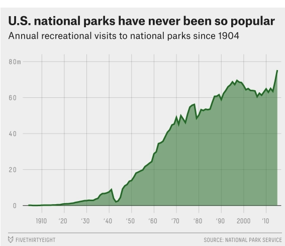 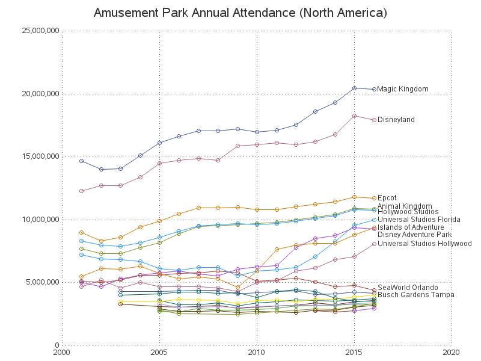 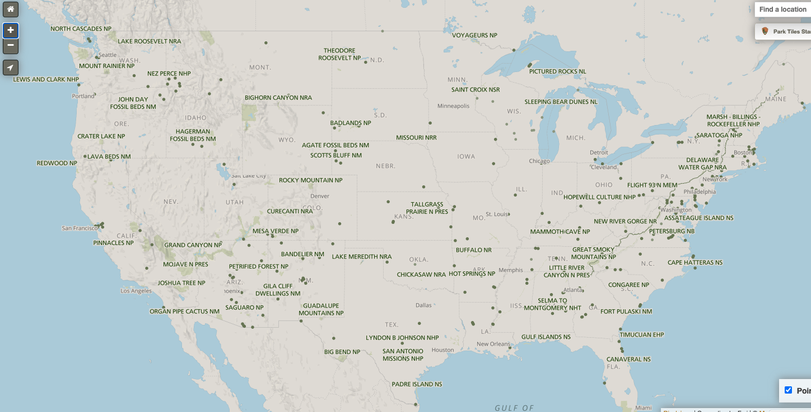 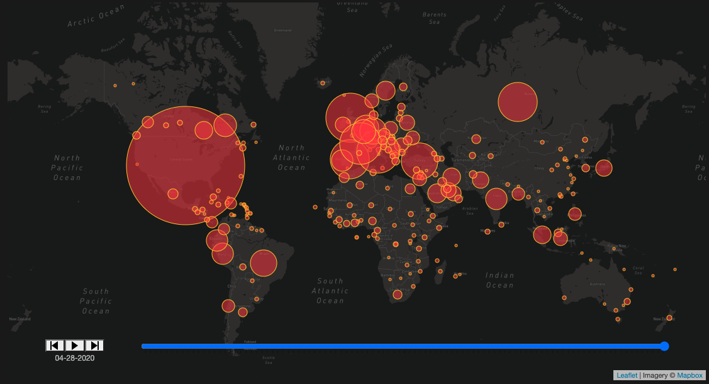 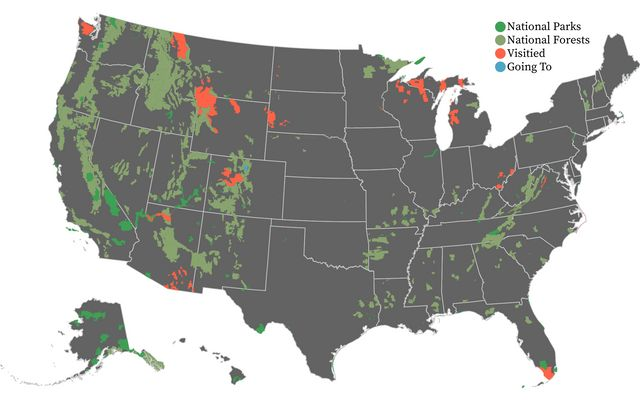
 

 
<h1>How to Create This Website</h1>

 
<h2>ETL</h2>
 
<h3>Extract</h3>
 
<ol>
    <li>Visit NPS site to find data</li>
    <li>Download or copy data from origin sites into Excel files</li>
        <ul>
            <li>1979 data to present(20 years at a time are available, select appropriate dropdowns) <a href="https://irma.nps.gov/STATS/SSRSReports/National%20Reports/Annual%20Visitation%20By%20Park%20(1979%20-%20Last%20Calendar%20Year)">from NPS.gov</a></li>
            <li>Park inception attendence to 1979 <a href="https://irma.nps.gov/STATS/SSRSReports/National%20Reports/Query%20Builder%20for%20Historic%20Annual%20Recreation%20Visits%20(1904%20-%201979)">from NPS.gov</a></li>
            <li>Park inception date, image, and description information <a href="https://en.wikipedia.org/wiki/List_of_national_parks_of_the_United_States">from Wikipedia</a></li>
            <li>Monthly Attendence Data <a href="https://irma.nps.gov/STATS/SSRSReports/Park%20Specific%20Reports/Visitation%20by%20Month?Park=MORA">From NPS.gov</a></li>
            <li>Save the original csvs into a data folder inside your project repository</li>
            </ul></ol>
         
<h3>Transform</h3>
 
<ol>
    <li>Inception, Attendent, and General Info Data:</li>
        <ul>
            <li>Note which parks are considered "NPRES" and remove those rows (use Excel or pandas module in Jupyter Notebook)</li>
            <li>Reformat any names and dates that don't match and fill park codes</li>
            <li>Remove redundant columns</li>
            <li>Combine and reformat yearly attendence data tables into one master table</li>
            <li>Export cleaned master csv into the data folder in your repository</li>
        </ul>
    <li>Monthly Attendence Data:
    <ul>
            <li>Gather last four years of data for each park</li>
            <li>Find the average of the monthly numbers to get a four year running average</li>
            <li>Create new csv using Excel with data averages</li>
            <li>Export csv to data folder in repository</li>
        </ul>
</ol>
 
<h3>Load</h3>
 
    <li>Run the <a href ="np_data_ETL.py">np_data_ETL.py</a> file in you terminal, which will:</li>
    <ul>
    <li>Import cleaned data from csv files</li>
    <li>Split area columns, add miles squared by applying math functions to acres column</li>
    <li>Convert data types from strings to integers or floats where necessary</li>
    <li>Create a dicionary of park data by looping through data and assigning keys and values</li>
    <li>Establish a connection with mongoDB</li>
    <li>Clear any old databases, and push data into mongoDB to create fresh database collections</li>
    </ul>
  
<h2>Create a Flask powered API</h2>
 
Using Anaconda's Flask module, we created an app.py file which leads users to endpoints of our API and allows the data to be accessed in JSON format from the MongoDB databases and query URLs.
 
Dependencies imported, data accessed, and homepage routed to the index.html file which will render the main page 
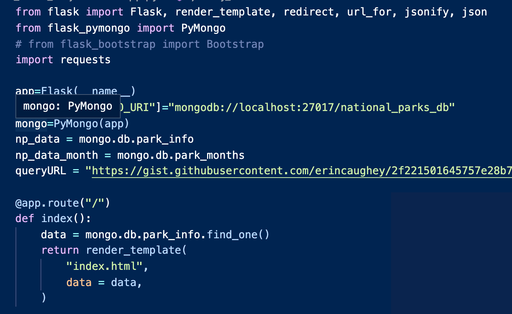
 
Multiple endpoints were created, one for each of the datasets used:
<ul>
<li>General Park Info and Yearly Attendence Data (MongoDB)</li>
<li>Averaged Monthly Park Attendence Data (MongoDB)</li>
<li>GeoJson Park Perimeter Coordinate Data (URL Query)</li>
</ul>
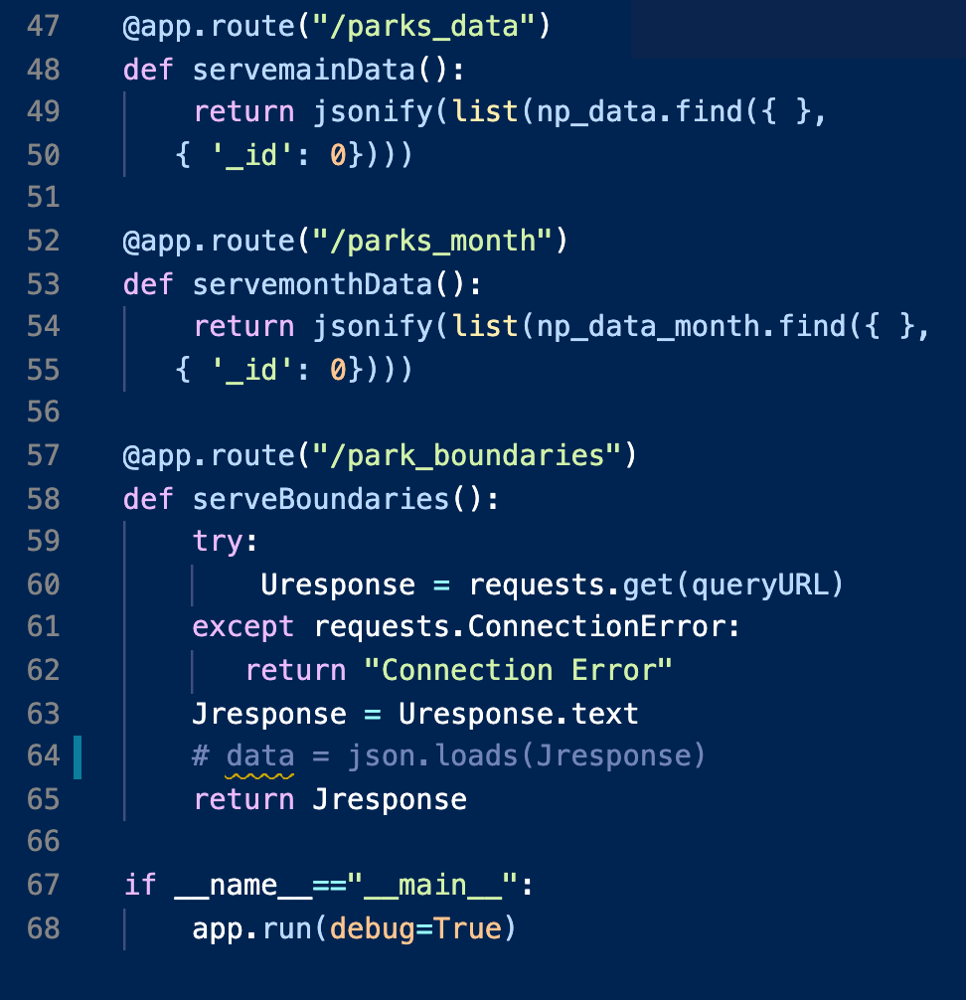
 
<h2>JavaScript</h2>
 

Each team member tackled a visualization which tells a story about the National Parks. Using JavaScript, data was accessed from our API and transformed into interactive graphs, charts, and maps.
 

The first visualization on the homepage after the park posters is an interactive leaflet map with park boundaries, adorable star shaped markers, and mouseover popups with park info inside. Get a full picture of where the parks are, and how much space they cover. Don't be shy, zoom in! You can explore the code for the map <a href ="static/js/np_parkboundariesMap.js">here</a>. 
    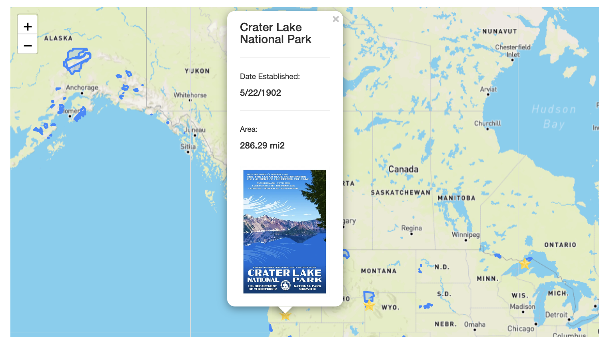
 

The second visualization is a line graph depicting the history of each park's visitor attendence in a given year from inception to the year 2019. This graph features a dropdown menu that allows you to explore the history of each park in detail, as well as a mouseover feature on the line ittself which specifies the year and visitors for any time you'd like to learn about. Feast your eyes on the graph code <a href ="static/js/np_lineGraph.js">here</a>.
     
    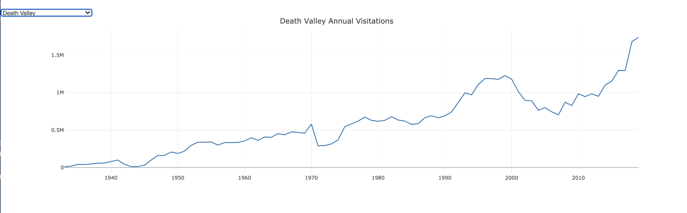
 

 The third visualization is an interactive video map combo, and dare I say the feature of the project. It boasts a play button that gives way to a map of the US that populates over the years with park markers as they became established over time, as well as circle radius markers that change in magnitude over the course of the video to signify park visitation and popularity over the years. Dive into the code for the map <a href ="static/js/np_timelineMap.js">here</a>. 
    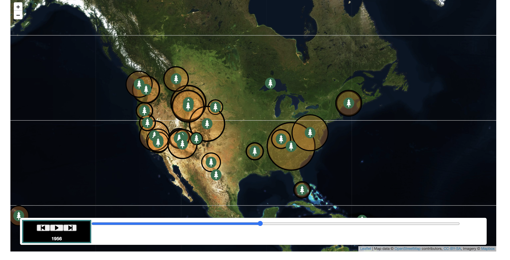
 

Our final visualization on the homepage is a nifty tool that helps you plan your park visit when it is convenient for you, adding the ability to see when most poeple are or aren't also visiting. What's your preference? It allows the user to see an average attendence for each park for each month using attendence data for the last four years. It is interactive upon mouse-over with opacity changes and popups with data. You can check out the code <a href ="static/js/np_heatmap.js">here</a>.
  
<h2>HTML/CSS</h2>
In the templates folder of the repository, you will find the index.html file which connects knits the javascript files together from the static/js folder into a cohesive arrangement. Each javascript file has a unique script, and each visualization has a unique ID that is referenced by the index.html code and connect all the files. The css is accessed from its place in the static folder by the index.html, and adds style to the borders and text on the homepage. The index.html page also uses jinja to create a loop to populate some images relating to the naitonal parks to spice up the hoempage and draw the users interest.
Any programs and packages that were referenced and used in the visualization have to be referenced in the index.html for the visualizations to work.
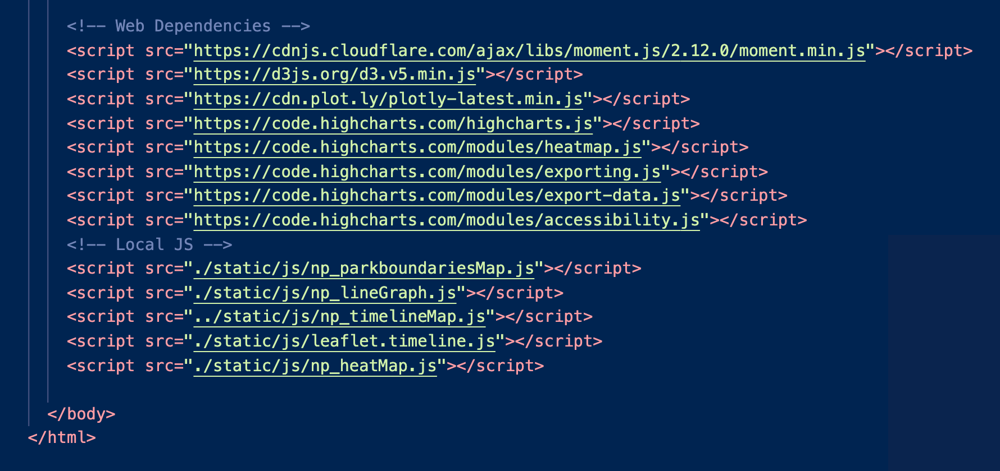
 
<h3>Want to make this site work for you??</h3>
<ol>
<li>Run the requirements.txt file in an environment in your terminal to download the necessary packages</li>
<li>Run the np_data_ETL.py file in your terminal</li>
<li>Run the app.py file in your terminal</li>
<li>Command+Click on the local route produced by the app.py file</li>
<li>Get inspired to visit a National Park!</li></ol>
 
